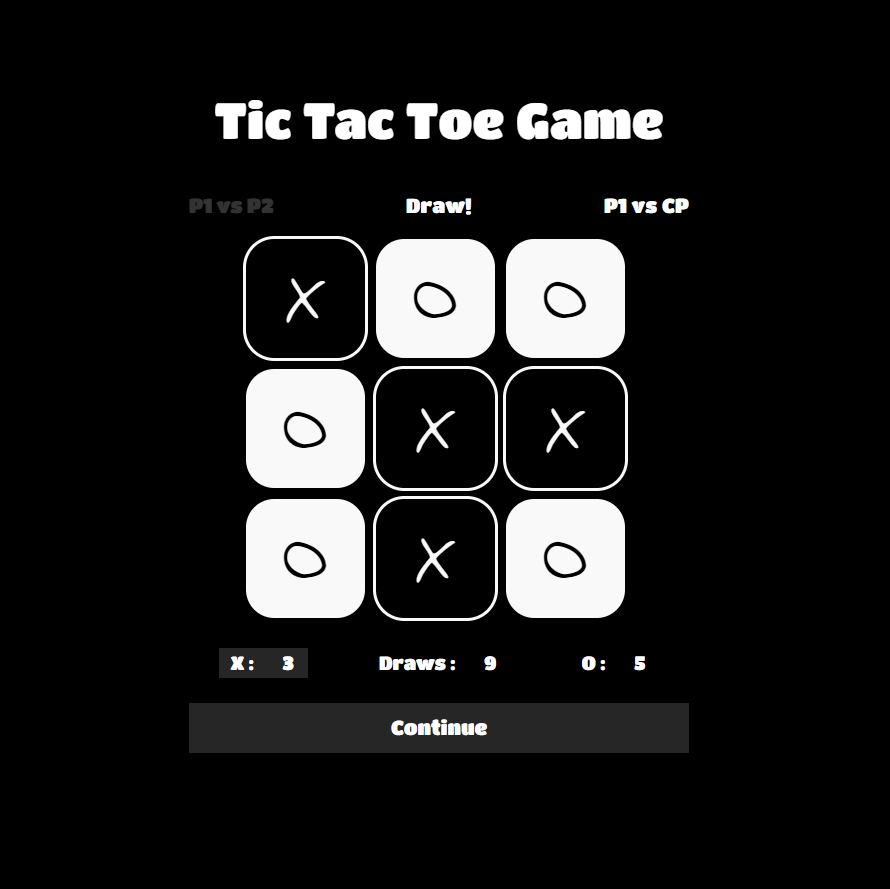

# A-TicTacToe-Game
## Overview
Implementation of the traditional Tic Tac Toe game built with HTML, CSS, JavaScript and JQuery. The project also includes an older version written in C.
* Play as X or O
* Play against a friend in Player vs Player mode or against the computer in Player vs CP mode.
* Keeps track of scores
* AI set at easy-medium level.

Demo link: https://codepen.io/cdngouma/pen/ejgZzJ 

Original project idea link: https://www.freecodecamp.com/challenges/build-a-tic-tac-toe-game
## Screenshot

