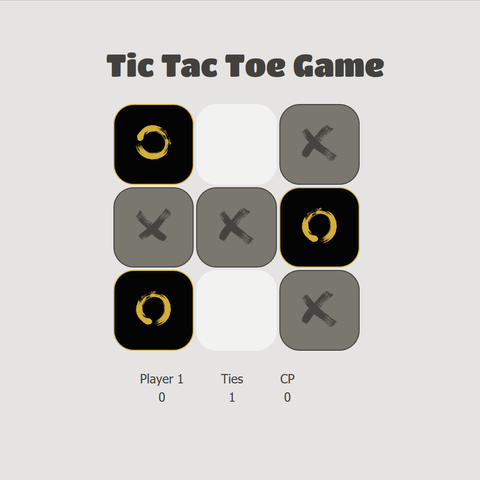

# A-TicTacToe-Game
## Overview
Implementation of the traditional Tic Tac Toe game built with HTML, CSS, JavaScript and JQuery. The project also includes an older version written in C.
* Play against a friend in Player vs Player mode or against the computer in Player vs CP mode.
* Switch between game modes by clicking on the P2/CP score/label.
* Keep track of wins and draws with the statistics bar.
* AI set at medium level.

Demo link: https://codepen.io/cdngouma/pen/ejgZzJ 

Original project idea link: https://www.freecodecamp.com/challenges/build-a-tic-tac-toe-game
## Screenshot

